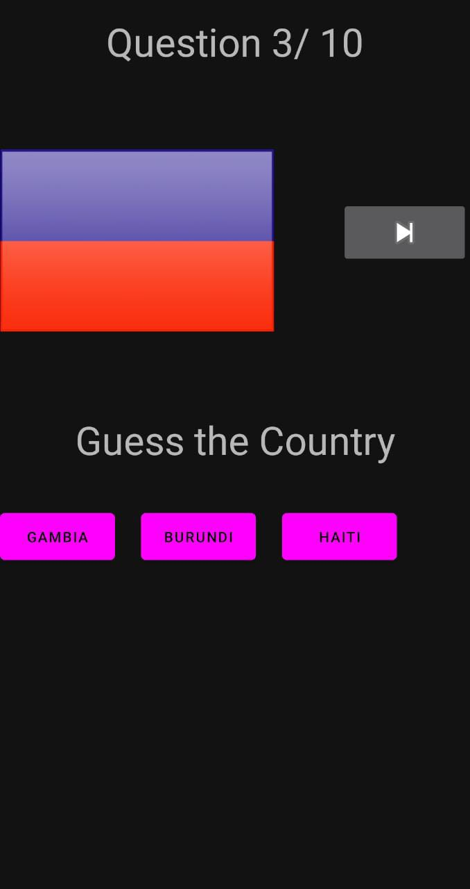

<h1>FlagQuiz Mobile Application</h1>

  <h2>Overview:</h2>
  

    The FlagQuiz mobile application is a quiz game that tests the user's ability to correctly identify flags of various countries.
    Developed in Java, this interactive app provides an engaging and educational experience for users to enhance their knowledge of different national flags.
  

  <h2>Features:</h2>
  <ol>
    <li>
      <strong>Flag Recognition:</strong> The application presents the user with an image of a flag and three buttons displaying the names of different countries.
      The user's task is to choose the correct country corresponding to the displayed flag.
    </li>
    <li>
      <strong>Multiple Choice:</strong> To make the game challenging, two incorrect country names are randomly generated from the set of flags.
      The user must carefully analyze the flag and make an informed choice.
    </li>
    <li>
      <strong>Progress Tracking:</strong> The application keeps track of the user's progress during the quiz, displaying the current question number out of a total of 10.
      This feature allows users to gauge their performance and track their improvement.
    </li>
    <li>
      <strong>Feedback and Correct Answers:</strong> Once the user selects an answer, the application provides immediate feedback by displaying the correct answer below the buttons.
      This feature helps users learn from their mistakes and expand their knowledge of flags.
    </li>
    <li>
      <strong>Interactive Interface:</strong> The application includes an ImageButton that remains inactive until the user selects a response.
      This interactive element adds an element of suspense and engagement to the quiz experience.
    </li>
  </ol>

  <h2>Screenshots:</h2>
  

  <h2>Getting Started:</h2>
  

    To run the FlagQuiz mobile application, follow these steps:
  

  <ol>
    <li>Clone this repository</li>
    <li>Set up the development environment with Java and an Android emulator or physical Android device.</li>
    <li>Open the project in your preferred integrated development environment (IDE).</li>
    <li>Build and run the application on the emulator or device.</li>
    <li>Enjoy playing and learning with the FlagQuiz app!</li>
  </ol>

  

    We hope you enjoy playing and learning with the FlagQuiz mobile application! If you have any questions, feedback, or suggestions, please feel free to reach out to us.
  

  

    Happy flag guessing!
  

